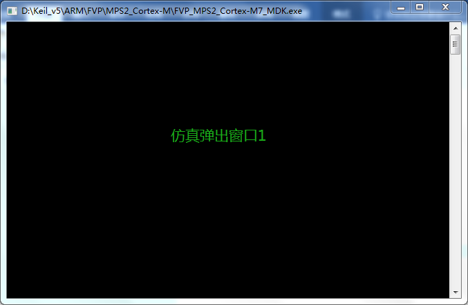

# 基于RT-Thread 实时操作系统的V2M-MPS2实验环境建立

## 目的
> V2M-MPS2是MDK提供的开发板，配合Fast Models Debugger，就可以不依赖任何硬件，在Cortex-M平台调试代码。
## 步骤及说明

### 下载并安装 MDK-Arm 集成开发环境
	
下载地址: [MDK-Arm](https://www.keil.com/download/product)
安装并注册软件完成后界面

### 使用V2M-MPS2需要打开windows的telnet客户端

[Win7打开telnet客户端](https://jingyan.baidu.com/article/eb9f7b6d8701ae869364e826.html)
[Win10打开telnet客户端](https://jingyan.baidu.com/article/ceb9fb10a9a1b48cad2ba0c4.html)

### 获取 RT-Thread 源码并生成 bsp/v2m-mps2 工程
	
GitHub仓库地址：[RT-Thread](https://github.com/RT-Thread/rt-thread)
使用env工具生成v2m-mps2工程，具体方法参考[RT-Thread官方文档](https://www.rt-thread.org/document/site/docs/tools/env/env-user-manual/)

### 打开工程并实现在线仿真

在bsp\v2m-mps2 目录下双击刚才生成的 project.uvprojx 即可打开MDK工程；或者在MDK 界面菜单栏选择 Project –> Open Project 选择 bsp\v2m-mps2 目录下的 project.uvprojx 打开工程。
工程打开后，如下图所示。

确认Options for Target 中debug选项是否配置正确（从GitHub仓库下载的源码，使用官方env工具配置生成的工程默认是配置好的，无需更改）：

确认选择Use：Models Cortex-M Debugger

确认无误后，需要先编译整个工程。点击工具栏的  按钮即可实现工程的全部重新编译。

注：工具栏常用的按钮有两个 , 第一个为Bulid，第二个为Rebuild。它们的区别是：当修改工程的某个文件后，点击第一个Build按钮，只编译当前修改的文件，这样操作的好处是在工程文件足够多时，不对整个工程重新编译，所以编译生成可执行文件的速度较快，但是在某些时候这样做会导致链接时报错，这时候就需要执行下面要说的第二个按钮— Rebuild。

顾名思义，Rebuild是重新编译，即无论文件是否有修改，整个工程的所有文件都全部重新编译，这样做会避免一些编译链接时的错误，但是工程文件量足够大时，会编译的很慢。

编译完成后，Build Output窗口输出

0 Error(s), 0 Warning(s) 即表示编译成功，没有错误，也没有警告。

下面开始调试仿真，点击调试按钮，如下图所示

这时MDK会进入调试（Debug）模式，并且会弹出两个窗口，如下面所示：

### 仿真运行
点击Run图标 ，或者按键盘 F5，会再弹出一个窗口，此窗口可看到RT-Thread系统输出打印信息：

至此，V2M-MPS2环境已搭建完成！

# 讨论和反馈

欢迎登陆[RT-Thread开发者社区](https://www.rt-thread.org/qa/forum.php)进行交流

# RT-Thread参考文献