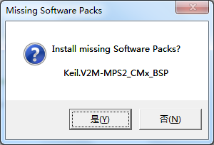

# V2M-MPS2开发环境搭建

## 目的
> 本文的目的是搭建一套不依赖于开发板的RT-Thread运行和调试环境，V2M-MPS2是MDK提供的开发板，配合Fast Models Debugger，就可以不依赖任何硬件，在Cortex-M平台调试代码。

## 步骤及说明

### 下载并安装 MDK-Arm 集成开发环境
	
下载地址: [MDK-Arm](https://www.keil.com/download/product)
安装并注册软件完成后界面

### 使用V2M-MPS2需要打开windows的telnet客户端

[Win7打开telnet客户端](https://jingyan.baidu.com/article/eb9f7b6d8701ae869364e826.html)

[Win10打开telnet客户端](https://jingyan.baidu.com/article/ceb9fb10a9a1b48cad2ba0c4.html)

### 获取 RT-Thread 源码并生成``` bsp/v2m-mps2 ```工程
	
GitHub仓库地址：[RT-Thread](https://github.com/RT-Thread/rt-thread)
使用env工具生成v2m-mps2工程，具体方法参考[RT-Thread官方文档](https://www.rt-thread.org/document/site/docs/tools/env/env-user-manual/)

### 打开工程并实现在线仿真

在``` bsp\v2m-mps2 ```目录下双击刚才生成的``` project.uvprojx ```即可打开MDK工程；或者在MDK 界面菜单栏选择``` Project –> Open Project ```选择``` bsp\v2m-mps2 ```目录下的``` project.uvprojx ```打开工程。

若是首次使用 V2M-MPS2，会提示安装相应的pack包


保持PC可以联网，点击“是(Y)”即可在线安装``` V2M-MPS2_CMx_BSP ```包。


注：也可下载离线安装包进行安装，下载路径：[V2M-MPS2_CMx_BSP pack包离线下载](http://www.keil.com/dd2/pack/)


pack包安装完成后，工程打开，如下图所示。

确认```Options for Target ```中 debug 选项是否配置正确（从 GitHub 仓库下载的源码，使用官方 env 工具配置生成的工程默认是配置好的，无需更改）：

确认选择```Use：Models Cortex-M Debugger```


确认无误后，需要先编译整个工程。点击工具栏的  按钮即可实现工程的全部重新编译。

编译完成后，```Build Output ```窗口输出

```0 Error(s), 0 Warning(s) ```即表示编译成功，没有错误，也没有警告。

下面开始调试仿真，点击调试按钮，如下图所示


这时 MDK 会进入调试（Debug）模式，并且会弹出两个窗口，如下面所示：


### 仿真运行
点击Run图标 ，或者按键盘 F5，会再弹出一个窗口，此窗口可看到RT-Thread系统输出打印信息：


至此，V2M-MPS2环境已搭建完成！

## samples 例程切换
### 说明 
RT-Thread samples 包提供了多个实验例程供读者进行学习、使用，本节介绍如何切换不同的
samples 例程

### 例程切换说明
### 方法一：在 env 工具中使用 menuconfig 图形化界面切换例程
在``` rt-thread\bsp\v2m-mps2 ```目录下使用 env 工具的 menuconfig 命令，依次选择：

	RT-Thread online packages  --->
		miscellaneous packages  --->
			[*] samples: RT-Thread kernel and components samples     
				select a sample ([basic] led)  --->                                                                                                    
				samples version (latest)  --->

点击进入 select a sample ([basic] led)   --> 选项即可选择所需要的 samples 例程进行切换


### 方法二： 在 rtconfig.h 文件中通过相关宏进行选择
例如选择 led 例程，可添加如下宏：

	
	/* miscellaneous packages */
	#define PKG_USING_SAMPLES

	#define RT_USING_SAMPLE_LED
	#define PKG_USING_SAMPLES_LATEST_VERSION 

#### 说明
##### ``` #define PKG_USING_SAMPLES ``` 对应于选择了 menuconfig 中的 ```  [*] samples: RT-Thread kernel and components samples ```

##### ``` #define RT_USING_SAMPLE_LED ``` 对应于选择了 menuconfig 中的 ``` select a sample ([basic] led)  ---> ```

##### ``` #define PKG_USING_SAMPLES_LATEST_VERSION ```对应于选择了 menuconfig 中的 ``` samples version (latest)  ---> ```

具体的选项可以参考 env 工具安装目录下 ``` env\packages\packages\misc\samples ``` 中的``` Kconfig ```文件

               	
# 讨论和反馈

欢迎登陆[RT-Thread开发者社区](https://www.rt-thread.org/qa/forum.php)进行交流

# RT-Thread参考文献