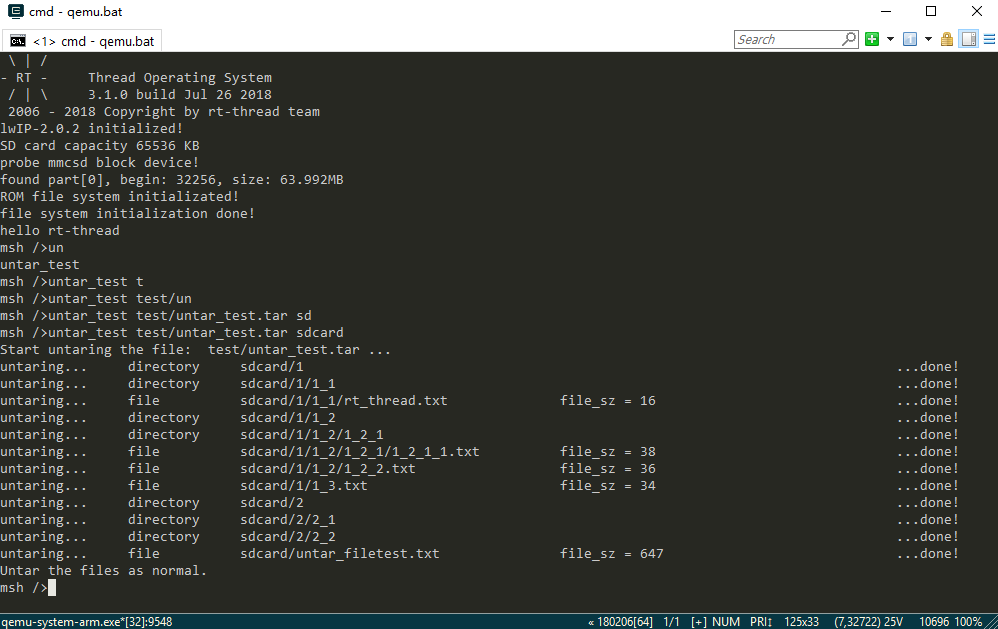

# 解压一个 tar 文件#

这个例程展示了如何将一个指定路径的 tar 包解压到指定路径。

## 程序清单 ##

```{.c}
/*
 * 程序清单：保存与设置读取目录位置
 *
 * 程序会创建一个解压 tar 文件的函数并导出到msh命令列表
*/

#include <stdlib.h>
#include <rtthread.h>

#ifdef RTTHREAD_VERSION /* with RT-Thread RTOS */

#ifdef RT_USING_DFS
#include <dfs_posix.h>
#include <rtdevice.h>

#ifdef RT_USING_FINSH
#include <finsh.h>
#endif

#define MAX_FNAME_LEN 256

/* supported file type */
#define REGTYPE		        '0'		/* regular file */
#define REGTYPE0	        '\0'    /* regular file (ancient bug compat)*/
#define DIRTYPE		        '5'     /* directory */
#define GNULONGNAME         'L'     /* GNU long (>100 chars) file name */

#define NAME_SIZE	        100

/* A few useful constants */
#define TAR_MAGIC          "ustar"        /* ustar and a null */
#define TAR_VERSION        "  "           /* Be compatable with GNU tar format */
#define TAR_MAGIC_LEN		6
#define TAR_VERSION_LEN		2
#define TAR_BLOCK_SIZE		512
#define TAR_BUFSZ			(1024 * 32)

struct TarHeader
{
    /* byte offset */
    char name[NAME_SIZE];         /*   0-99 */
    char mode[8];                 /* 100-107 */
    char uid[8];                  /* 108-115 */
    char gid[8];                  /* 116-123 */
    char size[12];                /* 124-135 */
    char mtime[12];               /* 136-147 */
    char chksum[8];               /* 148-155 */
    char typeflag;                /* 156-156 */
    char linkname[NAME_SIZE];     /* 157-256 */
    char magic[6];                /* 257-262 */
    char version[2];              /* 263-264 */
    char uname[32];               /* 265-296 */
    char gname[32];               /* 297-328 */
    char devmajor[8];             /* 329-336 */
    char devminor[8];             /* 337-344 */
    char prefix[155];             /* 345-499 */
    char padding[12];             /* 500-512 (pad to exactly the TAR_BLOCK_SIZE) */
};

static int make_directory(const char *dir)
{
    char *s = rt_strdup(dir);
    char *path = s;
    char c;
    int ret = 0;
	DIR *d;

    do
    {
        c = 0;
        /* Bypass leading non-'/'s and then subsequent '/'s. */
        while (*s)
        {
            if (*s == '/')
            {
                do {
                    ++s;
                } while (*s == '/');
                c = *s;                /* Save the current char */
                *s = 0;                /* and replace it with nul. */
                break;
            }
            ++s;
        }     
		d = opendir(path);
		if (d != RT_NULL)
		{
			/* directory exist */
			closedir(d);
			*s = c;
			continue;
		}
		/* create this directory */
        ret = mkdir(path, 0777);
        if (ret < 0)
            goto out;

		if (!c)
            break;
        /* Remove any inserted nul from the path (recursive mode). */
        *s = c;
    } while (1);

out:
    rt_free(path);
    return ret;
}

static int tar_check_header(struct TarHeader *header)
{
	int index;
	long chksum, sum = 0;
	unsigned char *s = (unsigned char *)header;

	/* Check the checksum */
	/* Get checksum value */
	chksum = strtol(header->chksum, NULL, 8);

	for (index = sizeof(struct TarHeader); index-- != 0;)
		sum += *s++;
	/* Remove the effects of the checksum field (replace
	 * with blanks for the purposes of the checksum) */
	s = (unsigned char *)header->chksum;
	for (index = sizeof(header->chksum) ; index-- != 0;)
		sum -= *s++;
	sum += ' ' * sizeof(header->chksum);
	if (sum != chksum )
	{
		rt_kprintf("bad header!\n");
		return -1;
	}

	return 0;
}

int tar_diff(char* target_dir, char *diff_file)
{
    static struct dfs_fd fd;
    static struct dirent dirent;
    struct stat stat;
    int length;
    char *fullpath, *path;
	int findfile_result=0;
    char *findfile = diff_file;
    fullpath = NULL;
    path = target_dir;
    if (path == NULL)
	{
		return -2; /* out of memory */
    }

    /* list directory */
    if (dfs_file_open(&fd, path, O_DIRECTORY) == 0)
    {
        do
        {
            memset(&dirent, 0, sizeof(struct dirent));
            length = dfs_file_getdents(&fd, &dirent, sizeof(struct dirent));
            if (length > 0)
            {
                memset(&stat, 0, sizeof(struct stat));

                /* build full path for each file */
                fullpath = dfs_normalize_path(path, dirent.d_name);
                if (fullpath == NULL)
                    break;

                if (dfs_file_stat(fullpath, &stat) == 0)
                {
					if(strcmp(dirent.d_name,findfile)==0)
					{
						findfile_result=1;
                        return -1;
					}
                }
                else
                    rt_kprintf("BAD file: %s\n", dirent.d_name);
                rt_free(fullpath);
            }
        }while(length > 0);
        dfs_file_close(&fd);
		if(findfile_result==0)
		{
            return 0;
		}
    }
    else
    {
        rt_kprintf("No such directory\n");
    }
    return -3;
}


/* untar a flash device to a file system */
int untar_sample(int argc, char **argv)
{
    int res;
	int file_sz;
	char *fn, *target_fn = RT_NULL;
    char* target_dir;
    char* untar_file;
	unsigned char* buf = RT_NULL;
	struct TarHeader *header = RT_NULL;
    unsigned int read_len;
    int tar_diff_result;
    char *target_path;
    char dir_check_path[50] = {0};
    char dir_check[50];
    int target_path_len;
    int target_path_level = 1;
    int dir_check_path_len = 0;
    int dir_check_result = 0;
    int i=0;
    
    if(argc != 3)
    {
        rt_kprintf("Usage: untar_sample \n");
        rt_kprintf("Like: untar_sample   filename.fileformat   /sdcard\n");
        return -1;
    }
    untar_file = argv[1];
    target_dir = argv[2];
    target_path = target_dir;
    target_path_len = strlen(target_path)+1;
    while(target_path_len--)
    {
        dir_check_path_len++;
        if(*target_path != '/' && target_path_len > 0)
            dir_check[i++] = *target_path;
        else 
        {
            dir_check[i] = '\0';
            strncpy(dir_check_path, target_dir , dir_check_path_len - strlen(dir_check)-1);
            tar_diff_result = tar_diff(dir_check_path, dir_check);
            if(tar_diff_result < 0)
            {
                dir_check_result = 1;
            }    
            else if(tar_diff_result == 0 && target_path_level ==1) 
            {
                rt_kprintf("Cannot untar to directory /%s.\n", target_dir);
                rt_kprintf("Please set the directory under the read-write directory.\nFor example, the SD card mount directory.\n");
                goto __exit;
            }
            else 
            {
                dir_check_result = 0;  
                break;
            }                
            i = 0;
            target_path_level++;
        }
        target_path++;
    }
    //rt_kprintf("dir_check_result ...%d \n", dir_check_result);
    if(dir_check_result == 0)
    make_directory(target_dir);
    
    res = -RT_ENOMEM;
	buf = rt_malloc(TAR_BUFSZ);
	if (buf == RT_NULL) goto __exit;

	header = rt_malloc(sizeof(*header)); //sizeof(*header)
	if (header == RT_NULL) goto __exit;
    res = RT_EOK;
    int fd_tar = -1;
    
    fd_tar = open(untar_file, O_RDONLY);
    if (fd_tar < 0)
    {
        rt_kprintf("Error: Unable to open file %s.\n", untar_file);
        return -1;
    }
    rt_kprintf("Start untaring the file:  %s ...\n", untar_file);
	while (1)
	{
        /* read raw header */
        read_len = read(fd_tar, header, 512);
        if (!read_len)
        {
            /* read data failed */
            res = rt_get_errno();
            goto __exit;
        }
        if (header->name[0] == '\0')
            break; /* end of tarball file */
        
         /* Check checksum */
        if (tar_check_header(header) != 0)
        {
            res = -RT_ERROR;
            rt_kprintf("tar_check_header error.");
            goto __exit;
        }

        /* get file name */
        if (target_dir == RT_NULL)
            target_fn = dfs_normalize_path("/", header->name);
        else
            target_fn = dfs_normalize_path(target_dir, header->name);
        fn = target_fn;
        
        /* get type and size of file */
        if (header->typeflag == REGTYPE || header->typeflag == REGTYPE0)
        {
            int fd;

            if(tar_diff(target_dir, header->name) < 0)
            {
                rt_kprintf("File:  %s already exists in /%s.\n", header->name, target_dir);
                rt_kprintf("Please modify the untar path or try again after deleting the original File.\n");
                goto __exit;
            }
            
            /* extract file */
            file_sz  = strtol(header->size, NULL, 8);       
            rt_kprintf("untaring...     file          ");
            rt_kprintf("%-40s", fn);          
            rt_kprintf("file_sz = %-32d...", file_sz);
            
            /* open target file for write */
            fd = open(fn, O_CREAT|O_TRUNC|O_WRONLY, 0);
            if (fd < 0)
            {
                res = rt_get_errno();
                rt_kprintf("open file failed! errno: %d\n", res);
                goto __exit;
            }

            /* read data and write data to a new file */
            while (file_sz)
            {
                int read_length, length;

                /* get the length for one chunk read */
                read_length = file_sz > TAR_BUFSZ ? TAR_BUFSZ : (file_sz/TAR_BLOCK_SIZE + 1)*TAR_BLOCK_SIZE;
                /* read data and write it to target file */
                length = read(fd_tar, buf, read_length);
                //length = _nftl_untar_nand_read(&buffer, buf, read_length);
                if (file_sz < TAR_BUFSZ)
                {
                    write(fd, buf, file_sz);
                    break;
                }
                else
                {
                    write(fd, buf, length);
                    file_sz -= length;
                }
                
                rt_kprintf("#");
            }

            rt_kprintf("done!\n");
            close(fd);
        }
        else if (header->typeflag == DIRTYPE)
        {
            /* make directory */     
            *(header->name + strlen(header->name)-1) = '\0';            
            if(tar_diff(target_dir, header->name) < 0)
            {
                rt_kprintf("Dir:  %s already exists in /%s.\n", header->name, target_dir);
                rt_kprintf("Please modify the untar path or try again after deleting the original directory.\n");
                goto __exit;
            }
            rt_kprintf("untaring...     directory     ");
            res = make_directory(fn);
            if (res == 0)
            {
                //rt_kprintf("untar   %-32s...", header->name);
                rt_kprintf("%-82s...", fn);
                rt_kprintf("done!\n");
            }
            else
                goto __exit;
        }
        else if (header->typeflag == GNULONGNAME)
        {
            /* long file name */
            file_sz  = strtol(header->size, NULL, 8);

            /* TODO */
        }

        // /* release target_fn */
        rt_free(target_fn);
        target_fn = RT_NULL;
	}
    rt_kprintf("Untar the files as normal.\n");
__exit:
    close(fd_tar);
	if (target_fn != RT_NULL) rt_free(target_fn);
	if (buf != RT_NULL) rt_free(buf);
	if (header != RT_NULL) rt_free(header);

	return res;
}
/* 导出到 msh 命令列表中 */
MSH_CMD_EXPORT(untar_sample, untar sample);

#endif /* end of RT_USING_DFS     */
#endif /* end of RTTHREAD_VERSION */

```

## 运行结果 ##

在文件 test/untar_test.tar和目录sdcard存在的情况下，示例的结果:
 

可以看到根目录下有5个文件夹，此时运行示例程序。第一次读取根目录时从第一个文件夹开始读取，然后使用 `seekdir` 函数设置了第二次读取的位置为第三个文件夹的位置。因此第二次读取根目录时，系统从第三个文件夹开始读取直到最后一个文件夹。