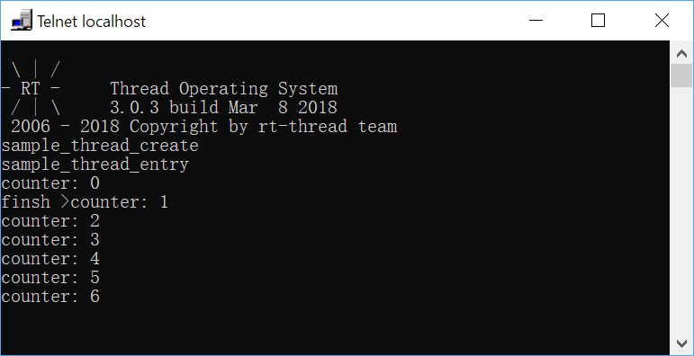

# thread_create sample 

## 1. 介绍

​	这个例程展示了如何在RT-THread里动态地创建线程。

## 2. 获取

​	运行该例程需要勾选ENV的相关选项，并确认RT-Thread的一些相关的配置选项已经打开。

### 2.1 配置

​	勾选"RT-Thread Sample Configuration -> Kernel Samples -> Select thread create sample"

### 2.2 依赖关系

​	动态创建线程，需要确保已经开启了HEAP：ENV的"RT-Thread Kernel -> Memory Management -> Using memory heap object to manage dynamic memory heap."选项已经勾选。​

​	如果使用了shell组件(finsh shell/msh shell)，那么可以在shell里面输入`list_mem`或者`list_memheap`查看更多Heap的信息。

## 3. 运行演示

运行结果：

## 4. 深入讲解 

todo

## 5. 参考

### 5.1 相关例程

todo

### 5.2 相关文档

todo